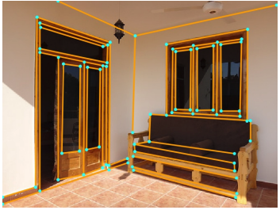
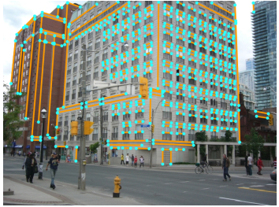
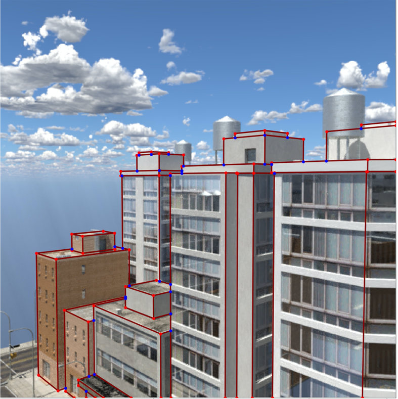
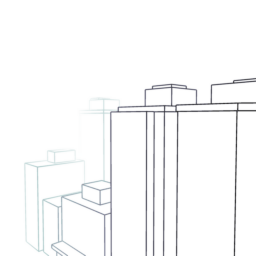
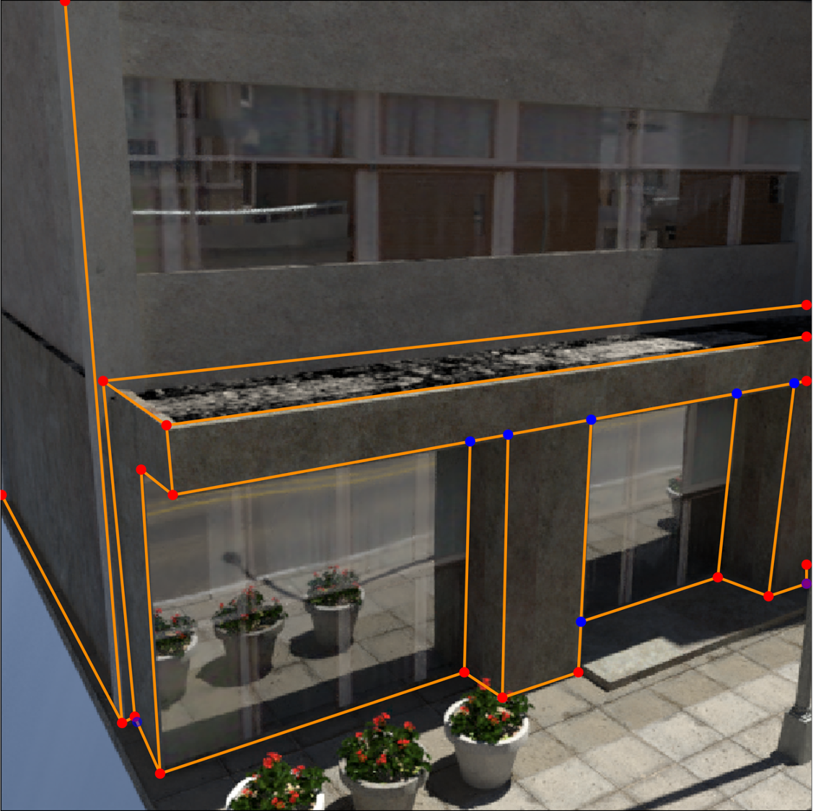
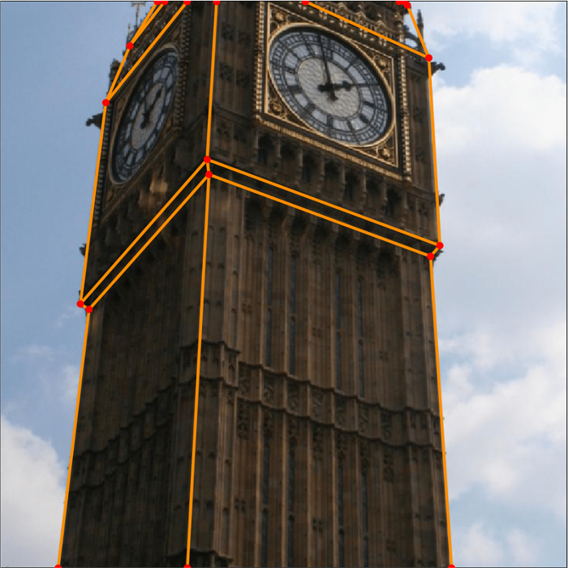

# Wireframe

> A curated list of papers & resources linked to Wireframe.

## Introduction

## Contents
- [2D Wireframe](#2d-wireframe)
    - [Papers](#papers-2d)
        - [2018](###2018)
        - [2019](###2019)
        - [2020](###2020)
        - [2021](###2021)
    - [Datasets (2D)](#data-2d)
- [3D Wireframe](#3d-wireframe)
    - [Papers](#papers-3d)
    - [Datasets (3D)](#data-3d)

# 2D Wireframe

The wireframe parsing task is firstly proposed in [1]. It proposes the task formulation, a large-scale dataset with wireframe annotations, a baseline method, and a set of evaluation metrics. 
After that, [4] proposes an end-to-end solution and significantly improves the performance. [3] is a counterpart work which introduce a relabeled dataset in [1]. 
Meanwhile, [8] is a follow-up work of [2] which holds the new state-of-the-art result. [6] designs a hough-transform based convolutional operator to treat the line detection task. 
In order to handle the topology of junction and line, a graph neural network based method [5] was proposed to resolve the wireframe task. 
Besides, [7] proposes to speed-up the line detection.
Strictly speaking, line detection is not wireframe parsing as it does not detect junctions of multiple segments. 

## Papers

### 2018

- [1] Huang K, Wang Y, Zhou Z, et al. Learning to parse wireframes in images of man-made environments[C]. CVPR, 2018. [[code](https://github.com/huangkuns/wireframe)][[paper](https://arxiv.org/abs/2007.07527)]

### 2019

- [2] Xue N, Bai S, Wang F, et al. Learning attraction field representation for robust line segment detection[C]. CVPR, 2019. [[code](https://github.com/cherubicXN/afm_cvpr2019)][[paper](https://openaccess.thecvf.com/content_CVPR_2019/papers/Xue_Learning_Attraction_Field_Representation_for_Robust_Line_Segment_Detection_CVPR_2019_paper.pdf)]
- [3] Zhang Z, Li Z, Bi N, et al. Ppgnet: Learning point-pair graph for line segment detection[C]. CVPR, 2019. [[code](https://github.com/svip-lab/PPGNet)][[paper](https://www.aiyoggle.me/publication/ppgnet-cvpr19/ppgnet-cvpr19.pdf)]
- [4] Zhou, Yichao and Qi, Haozhi and Ma, Yi. End-to-End Wireframe Parsing[C]. ICCV, 2019. [[code](https://github.com/zhou13/lcnn)][[paper](https://arxiv.org/abs/1905.03246)]

### 2020

- [5] Quan Meng, Jiakai Zhang, Qiang Hu, Xuming He, and Jingyi Yu. 2020. LGNN: A Context-aware Line Segment Detector[C]. MM, 2020. [code][[paper](https://arxiv.org/abs/2008.05892)]
- [6] Lin Y, Pintea S L, van Gemert J C. Deep Hough-Transform Line Priors[C]. ECCV, 2020. [[code](https://github.com/yanconglin/Deep-Hough-Transform-Line-Priors)][[paper](https://arxiv.org/abs/2007.09493)]
- [7] Huang S, Qin F, Xiong P, et al. TP-LSD: Tri-Points Based Line Segment Detector[C]. ECCV, 2020. [[code](https://github.com/Siyuada7/TP-LSD)][[paper](https://arxiv.org/abs/2009.05505)]
- [8] Xue N, Wu T, Bai S, et al. Holistically-attracted wireframe parsing[C] CVPR, 2020. [[code](https://github.com/cherubicXN/hawp)][[paper](https://arxiv.org/pdf/2003.01663.pdf)]

### 2021

- [9] Yifan Xu*, Weijian Xu*, et al. Line Segment Detection Using Transformers without Edges[C] CVPR, 2021. [[code]()][[paper](https://arxiv.org/abs/2101.01909)]
- [10] Xili Dai, Xiaojun Yuan, et al. Fully Convolutional Line Parsing. arxiv 2021. [[code](https://github.com/Delay-Xili/F-Clip)][[paper](https://arxiv.org/abs/2104.11207v2)]

## Datasets (2D)

So far as we know, there exist two wireframe datasets namely [**ShanghaiTech**](https://github.com/huangkuns/wireframe) and [**YorkUrban**](https://www.elderlab.yorku.ca/resources/york-urban-line-segment-database-information/).
1. The **ShanghaiTech** dataset proposed from [1]. It contains 5,000 training images and 462 test images of man-made scenes which is a basic dataset used by all methods[1-8]. 
It has another relabeled version [**SIST**](https://github.com/svip-lab/PPGNet) which's junctions and lines are carefully labeled.
2. The **YorkUrban** is a early existent dataset which is a small dataset containing 102 images and only has Manhattan lines labeled. Most works test their model on it to evaluate the generalizability of models.  

|          |           | 
| :--------------------------------------------------: | :-------------------------------------------------: | 
| [**ShanghaiTech dataset**](https://github.com/huangkuns/wireframe) | [**YorkUrban dataset**](https://www.elderlab.yorku.ca/resources/york-urban-line-segment-database-information/) | 

### Leader Board

|              |                  | DWP[1]   | AFM[2]   |PPGNET[3] | LCNN[4]  | LGNN[5]  | DHT[6]   | TP-LSD[7]  | HAWP[8]  |  LETR[9]  |  F-Clip[10]  |
| :------:     | :------:         | :------: | :------: | :------: | :------: | :------: | :------: |:----------:|:------:  | :------:  |  :------:    |
| ShanghaiTech | sAP10 |   5.1    |  24.4    |   /      | 62.9     |   62.3   |  66.6    |  60.6      | 66.5     |  65.2     |  68.3        |
|              | APH   |   67.8   |  69.2    |          | 80.3     |    /     |    /     |  84.3      | 84.5     |  84.7     |  85.7        |
| YorkUrban    | sAP10 |   2.1    |   9.4    |   /      | 26.4     |    /     |  27.4    |  27.4      | 28.5     |  29.4     |  30.8        |
|              | APH   |   51.0   |   48.2   |          | 58.5     |    /     |    /     |    /       | 60.6     |  61.2     |  65.0        |

# 3D Wireframe

## Papers(3D)

- Zhou Y, Qi H, Zhai Y, et al. Learning to reconstruct 3D Manhattan wireframes from a single image[C]. ICCV, 2019. [[dataset](https://drive.google.com/drive/folders/11OBjTfMSIqFgFeS6c3M1UGZXpozV4S4P)][[code](https://github.com/zhou13/shapeunity)][[paper](https://arxiv.org/abs/1905.07482)][[video](https://www.youtube.com/watch?v=l3sUtddPJPY)]
- Pautrat R, Lin J T, Larsson V, et al. SOLD2: Self-supervised Occlusion-aware Line Description and Detection[C]. CVPR, 2021. [[code](https://github.com/cvg/SOLD2)][[paper](https://arxiv.org/abs/2104.03362)]

## Datasets (3D)

So far as we know, there exist two wireframe datasets: one synthetic dataset and one real world dataset. Both of them were proposed from [[Zhou](https://arxiv.org/abs/1905.07482)]

1. [**SceneCity**](https://drive.google.com/drive/folders/13zE_7tL5ms7YagaXJbzLFTM1ygBv2jRS) is synthetic city dataset which is generated through 3D mesh. 
The dataset includes 230 cities, each containing 8 × 8 city blocks. 100 viewpoints are generated for each city and then render to images through global illumination by Blender modeler.
The number of total images is 23000, first 22700 images for training and the rest 300 for validation.

2. [**MegaWireframe**](https://drive.google.com/drive/folders/1nvKZMU2fSECMo1BfW2Ge1EO1mBuKRq2n) is a realistic Landmark dataset which is relabeled from [MegaDepth v1](http://www.cs.cornell.edu/projects/megadepth/) dataset.
It selects about 200 images from [MegaDepth v1](http://www.cs.cornell.edu/projects/megadepth/) which is manually labeled with wireframes, and registered with the rough 3D depth. 

|          |           | 
| :--------------------------------------------------: | :-------------------------------------------------: | 
| [**SceneCity**](https://drive.google.com/drive/folders/13zE_7tL5ms7YagaXJbzLFTM1ygBv2jRS) | [**MegaWireframe**](https://drive.google.com/drive/folders/1nvKZMU2fSECMo1BfW2Ge1EO1mBuKRq2n) |

 